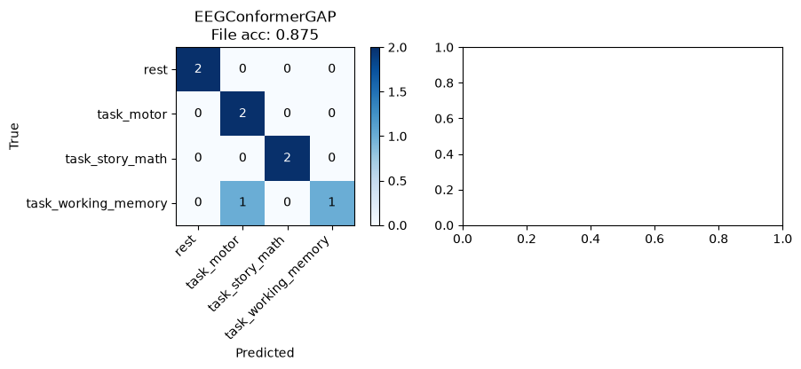
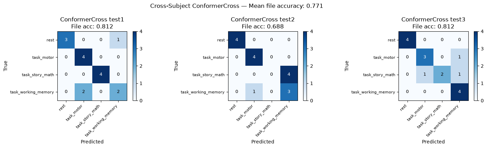
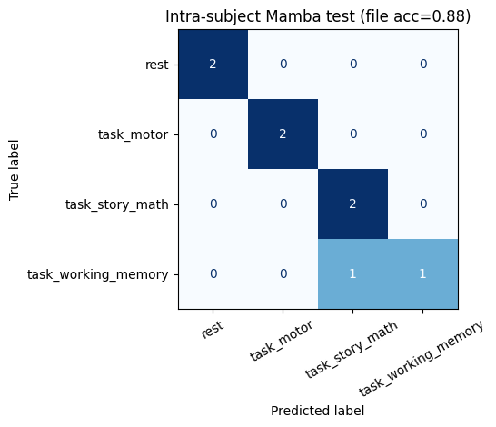
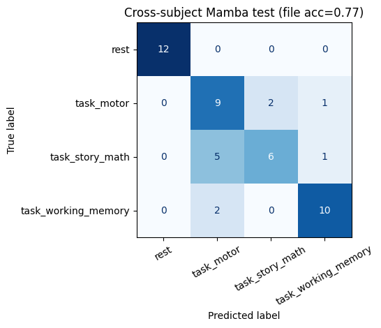

# Assignment 2 — MEG Brain-State Classification

Four-class decoding of magnetoencephalography (MEG) recordings into brain states:
`rest`, `task_motor`, `task_story_math`, and `task_working_memory` (chance = 0.25).

We evaluate three architectures under one shared preprocessing/evaluation protocol, in two
settings:

- **Intra-subject** — train and test on the same subject (`105923`).
- **Cross-subject** — train on subjects `113922` & `164636`, test on three unseen subjects.

## Results

File-level accuracy is the **primary metric** (a recording is the independent evaluation unit;
overlapping windows from one file are correlated). Window-level accuracy is diagnostic only.

| Model | Intra file-acc | Cross mean file-acc | Notebooks |
|---|---:|---:|---|
| EEGNet (Lawhern et al. 2018, adapted) | 0.625 | 0.646 | [`eegnet_protocol.ipynb`](notebooks/eegnet_protocol.ipynb) |
| Mamba (conv stem + bidirectional SSM) | **0.875** | **0.771** | [`mamba_train_intra.ipynb`](notebooks/mamba_train_intra.ipynb), [`mamba_train_cross.ipynb`](notebooks/mamba_train_cross.ipynb) |
| EEG Conformer (CNN + Transformer + GAP) | **0.875** | **0.771** | [`conformer_train_intra.ipynb`](notebooks/conformer_train_intra.ipynb), [`conformer_train_cross.ipynb`](notebooks/conformer_train_cross.ipynb) |

Cross-subject per-test breakdown: test1 / test2 / test3 file-acc = `0.812 / 0.688 / 0.812` (Mamba
and Conformer); `0.750 / 0.438 / 0.750` (EEGNet).

Full Mamba write-up and discussion: [`docs/mamba_results.md`](docs/mamba_results.md).

> **Note on the Conformer notebooks:** they were run but committed without inline cell outputs, so
> they render empty on GitHub. Their results are captured as the figures below
> (`notebooks/results/conformer_*.png`) and in the table above.

### EEG Conformer — intra (file-acc 0.875) and cross (mean file-acc 0.771)




### Mamba




## Repository layout

```
Assignment_2/
├── protocol_utils.py        # shared preprocessing + evaluation (see docs/training_protocol.md)
├── notebooks/
│   ├── 01_data_exploration.ipynb
│   ├── eegnet_protocol.ipynb
│   ├── mamba_train_intra.ipynb
│   ├── mamba_train_cross.ipynb
│   ├── conformer_train_intra.ipynb
│   ├── conformer_train_cross.ipynb
│   └── results/             # confusion matrices & training-history figures
├── docs/
│   ├── training_protocol.md # the shared protocol all models follow
│   ├── mamba_results.md     # detailed results & discussion
│   ├── figures/             # figures used in the write-ups
│   └── DL_project.pdf       # assignment brief
└── data/                    # MEG .h5 files — NOT in git (see "Data" below)
```

## The shared protocol

Every model is compared the same way via [`protocol_utils.py`](protocol_utils.py); only the
architecture differs between teammates. The pipeline: per-file sensor z-score → downsample by 4 →
`512`-sample windows with `256` stride → group-aware (no-window-leakage) train/val split → file-level
test metrics by mean-logit aggregation over windows. Cross-subject hyperparameters are selected with
leave-one-subject-out validation; test sets are touched only once for the final numbers.

See [`docs/training_protocol.md`](docs/training_protocol.md) for the model contract, the
fixed-vs-tunable table, and a copy-paste quick start.

## Data

The MEG `.h5` files (~10 GB) are **not** committed. Place them under `data/` as:

```
data/
├── Intra/{train,test}/
└── Cross/{train,test1,test2,test3}/
```

Notebooks expect this via `DatasetPaths(data_root="../data")` and import the shared module with
`sys.path.append("..")`, so they must be run from inside `notebooks/`.

## Running

```bash
pip install -r ../requirements.txt   # repo-root requirements
cd notebooks
jupyter lab                          # open any notebook and run top-to-bottom
```
